### Hi there, I'm Sander - aka [golles][github] 👋

[![BuyMeCoffee][buymecoffeebadge]][buymecoffee]

## I'm a Developer and Home Automation enthousiast!!

- 🤓 I’m currently learning Python 🐍
- 📱 Mobile app developer since 2012
- 🏢 Working for TomTom 🛰️ since 2011
- 🎯 Goals: Contribute more to Open Source projects
- 🤽‍♂️ Sports: I play water polo

## What I'm currently working on

### Home Assistant components

| Component                                                               | Active Installations                                                                                           | Stars                                                                                                | Coverage                                                                                                                                                                    |
| ----------------------------------------------------------------------- | -------------------------------------------------------------------------------------------------------------- | ---------------------------------------------------------------------------------------------------- | --------------------------------------------------------------------------------------------------------------------------------------------------------------------------- |
| [KNMI](https://github.com/golles/ha-knmi)                               |                |                      |                                          |
| [TomTom Travel Time](https://github.com/golles/ha-tomtom-travel-time)   |  |        |              |
| [Aquatlantis Ori](https://github.com/golles/ha-aquatlantis-ori)         |                 |           |                    |
| [Kamstrup 403](https://github.com/golles/ha-kamstrup_403)               |        |              |                          |
| [Kamstrup MC66C](https://github.com/golles/Home-Assistant-Sensor-MC66C) |               |  |  |

### Libraries

| Project                                                                         | Stars                                                                                             | Coverage                                                                                                                                                              |
| ------------------------------------------------------------------------------- | ------------------------------------------------------------------------------------------------- | --------------------------------------------------------------------------------------------------------------------------------------------------------------------- |
| [python-weerlive](https://github.com/golles/python-weerlive)                    |           |                    |
| [tomtom-apis-python](https://github.com/golles/tomtom-apis-python)              |        |              |
| [python-aquatlantis-ori](https://github.com/golles/python-aquatlantis-ori)      |    |      |
| [mock-yaml-secrets-action](https://github.com/golles/mock-yaml-secrets-action/) |  |  |

### Other

| Project                                                                  | Stars                                                                                          |
| ------------------------------------------------------------------------ | ---------------------------------------------------------------------------------------------- |
| [Home Assistant Config](https://github.com/golles/Home-Assistant-Config) |  |
| [ESPHome Config](https://github.com/golles/ESPHome-Config/)              |         |

 

---

### Connect with me:

[][website]
[][github]
[][twitter]
[][linkedin]
[][instagram]
[][reddit]

 

### Languages and Tools:

[][github]
[][github]
[][github]
[][github]
[][github]
[][github]
[][github]
[][github]
[][github]
[][github]
[][github]
[][github]
[][github]
[][github]
[][github]
[][github]
[][github]
[][github]

 

---

### GitHub stats

 

---

### Recent GitHub activity

<!--START_SECTION:activity-->

1. 🗣 Commented on [#332](https://github.com/golles/ha-knmi/issues/332#issuecomment-3714897329) in [golles/ha-knmi](https://github.com/golles/ha-knmi)
2. 🗣 Commented on [#332](https://github.com/golles/ha-knmi/issues/332#issuecomment-3714056471) in [golles/ha-knmi](https://github.com/golles/ha-knmi)
3. 🗣 Commented on [#189](https://github.com/golles/ha-kamstrup_403/issues/189#issuecomment-3693845156) in [golles/ha-kamstrup_403](https://github.com/golles/ha-kamstrup_403)
4. ℹ️ Labeled issue [#303](https://github.com/golles/ha-knmi/issues/303) in [golles/ha-knmi](https://github.com/golles/ha-knmi)
5. ℹ️ Unlabeled issue [#303](https://github.com/golles/ha-knmi/issues/303) in [golles/ha-knmi](https://github.com/golles/ha-knmi)
6. 🗣 Commented on [#188](https://github.com/golles/ha-kamstrup_403/issues/188#issuecomment-3690270540) in [golles/ha-kamstrup_403](https://github.com/golles/ha-kamstrup_403)
7. 🗣 Commented on [#1782](https://github.com/greghesp/ha-bambulab/issues/1782#issuecomment-3651329671) in [greghesp/ha-bambulab](https://github.com/greghesp/ha-bambulab)
8. 🗣 Commented on [#1782](https://github.com/greghesp/ha-bambulab/issues/1782#issuecomment-3649797812) in [greghesp/ha-bambulab](https://github.com/greghesp/ha-bambulab)
9. 🎉 Merged PR [#397](https://github.com/golles/tomtom-apis-python/pull/397) in [golles/tomtom-apis-python](https://github.com/golles/tomtom-apis-python)
10. 🎉 Merged PR [#141](https://github.com/golles/python-weerlive/pull/141) in [golles/python-weerlive](https://github.com/golles/python-weerlive)
<!--END_SECTION:activity-->

[website]: https://golles.nl
[github]: https://github.com/golles
[twitter]: https://twitter.com/golles13
[instagram]: https://instagram.com/golles13
[reddit]: https://www.reddit.com/u/golles13
[linkedin]: https://linkedin.com/in/sandergols
[buymecoffee]: https://www.buymeacoffee.com/golles
[buymecoffeebadge]: https://img.shields.io/badge/buy%20me%20a%20coffee-donate-yellow.svg?style=for-the-badge
